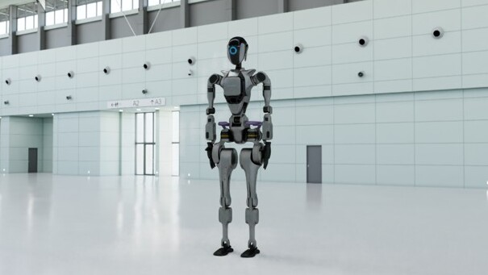

.. SPDX-FileCopyrightText: Copyright (c) 2026 NVIDIA CORPORATION & AFFILIATES. All rights reserved.
.. SPDX-License-Identifier: LicenseRef-NvidiaProprietary
..
.. NVIDIA CORPORATION, its affiliates and licensors retain all intellectual
.. property and proprietary rights in and to this material, related
.. documentation and any modifications thereto. Any use, reproduction,
.. disclosure or distribution of this material and related documentation
.. without an express license agreement from NVIDIA CORPORATION or
.. its affiliates is strictly prohibited.

Python: Minimal Example
=======================

This is the minimal Python example from the ovrtx README. It demonstrates the basic workflow:

1. Create a Renderer
2. Load a USD layer (with an inline USDA that references a remote scene)
3. Step the renderer to produce a frame
4. Map the rendered output and display it

.. pull-quote::

   *“Create the smallest useful Python example that loads an existing USD scene, renders one camera frame, maps the color output to CPU memory, and either displays it or saves it as an image through a command-line flag.”*

Prerequisites
-------------

- Python 3.10–3.13
- `uv <https://docs.astral.sh/uv/>`_

Running
-------

.. code-block:: bash

   uv run main.py

The first run can take some time as shaders are compiled and cached.
