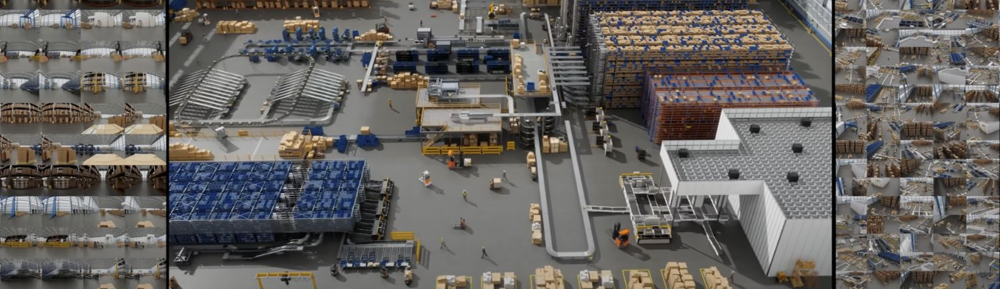

.. SPDX-FileCopyrightText: Copyright (c) 2026 NVIDIA CORPORATION & AFFILIATES. All rights reserved.
.. SPDX-License-Identifier: LicenseRef-NvidiaProprietary
..
.. NVIDIA CORPORATION, its affiliates and licensors retain all intellectual
.. property and proprietary rights in and to this material, related
.. documentation and any modifications thereto. Any use, reproduction,
.. disclosure or distribution of this material and related documentation
.. without an express license agreement from NVIDIA CORPORATION or
.. its affiliates is strictly prohibited.

NVIDIA ovrtx
============

Omniverse RTX is the technology that provides real-time, physically accurate sensor simulation and rendering for `Physical AI <https://www.nvidia.com/en-us/glossary/generative-physical-ai/>`_, targeting robotics learning, synthetic data generation, and industrial and design workflows. **ovrtx** is the lightweight C and Python SDK that exposes Omniverse RTX—you use it to integrate that sensor simulation and visualization into your own applications.

In this documentation you will find getting started guides for Python and C, API references, and example projects.

* :doc:`python_api/getting_started`
* :doc:`c_api/getting_started`

.. note::

   ovrtx is currently **pre-release** software.

Features
--------

* Physically accurate simulation of cameras, lidar, radar, ultrasonic and more sensors.
* Scalable simulation performance from reinforcement learning in-the-loop with tens of thousands of frames per second, through real-time, photorealistic, interactive viewport and navigation, to offline predictive rendering.
* `OpenUSD <https://aousd.org/>`_ scene description allowing interchange with a vast ecosystem of content creation, CAD and simulation tools.
* Easy integration with Python simulation and learning ecosystem.

Support
-------

https://forums.developer.nvidia.com/c/omniverse/300

License
-------

The software and materials are governed by the `NVIDIA Software License Agreement <https://www.nvidia.com/en-us/agreements/enterprise-software/nvidia-software-license-agreement/>`_ and the `Product-Specific Terms for NVIDIA Omniverse <https://www.nvidia.com/en-us/agreements/enterprise-software/product-specific-terms-for-omniverse/>`_.

.. toctree::
   :maxdepth: 2
   :caption: Getting Started

   python_api/getting_started
   c_api/getting_started

.. toctree::
   :maxdepth: 2
   :caption: Examples

   examples/index

.. toctree::
   :maxdepth: 2
   :caption: Python API

   python_api/index

.. toctree::
   :maxdepth: 2
   :caption: C API

   c_api/index

.. toctree::
   :caption: Links

   GitHub Repository <https://github.com/NVIDIA-Omniverse/ovrtx>

Indices and tables
==================

* :ref:`genindex`
* :ref:`search`
