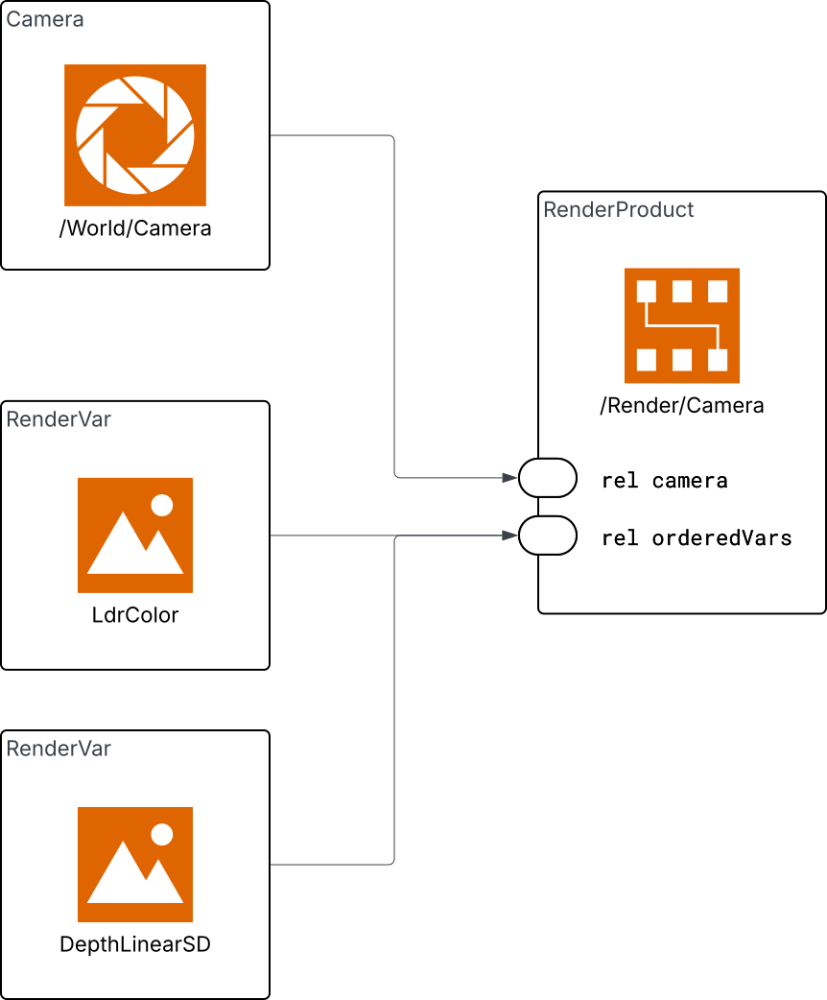

.. SPDX-FileCopyrightText: Copyright (c) 2026 NVIDIA CORPORATION & AFFILIATES. All rights reserved.
.. SPDX-License-Identifier: LicenseRef-NvidiaProprietary
..
.. NVIDIA CORPORATION, its affiliates and licensors retain all intellectual
.. property and proprietary rights in and to this material, related
.. documentation and any modifications thereto. Any use, reproduction,
.. disclosure or distribution of this material and related documentation
.. without an express license agreement from NVIDIA CORPORATION or
.. its affiliates is strictly prohibited.

Sensor Configuration
====================

To get rendered output from a sensor in ovrtx, the USD stage must describe *what* to render and *which outputs* to produce. This is done through two USD prim types from the `UsdRender <https://openusd.org/release/api/usd_render_page_front.html>`_ schema:

- **RenderProduct** -- represents a single sensor output configuration (resolution, which sensor to use, which variables to output).
- **RenderVar** -- declares a named output variable (e.g., ``LdrColor``, ``HdrColor``) that the renderer produces for a RenderProduct.

These prims can either exist in the USD file being loaded, or be injected at runtime using ovrtx's USD composition API.

RenderProduct
-------------

Each sensor that you want output from needs a corresponding ``RenderProduct`` prim in the stage. The RenderProduct ties together:

1. A **sensor** (camera, lidar, etc.) via the ``rel camera`` relationship.
2. One or more **output variables** via the ``rel orderedVars`` relationship, which points to ``RenderVar`` prims.
3. Settings controlling the rendering of the sensor, such as the output image resolution for a camera, or the render mode used to render it. For camera render modes and settings, see :doc:`cameras/render_modes`.

Here is a minimal RenderProduct in USDA that renders ``LdrColor`` from a camera at ``/World/Camera``:

.. tab-set::

   .. tab-item:: USDA

      .. literalinclude:: ../../tests/docs/usd/data/minimal_render_product.usda
         :language: usda
         :start-after: # [snippet:doc-minimal-render-product]
         :end-before: # [/snippet:doc-minimal-render-product]

   .. tab-item:: Python

      .. literalinclude:: ../../tests/docs/usd/test_usd_python_examples.py
         :language: python
         :start-after: # [snippet:doc-minimal-render-product-python]
         :end-before: # [/snippet:doc-minimal-render-product-python]
         :dedent:

The ``rel camera`` Relationship
^^^^^^^^^^^^^^^^^^^^^^^^^^^^^^^

``rel camera`` must point to the USD prim path of the sensor whose output you want. For camera sensors, this is typically a ``UsdGeomCamera`` prim.

.. code-block:: usda

   rel camera = </World/Camera>

It is also possible to specify multiple sensors in a single RenderProduct:

.. code-block:: usda

   rel camera = [</World/Environment1/Camera>, </World/Environment2/Camera>]

When a RenderProduct targets multiple sensors, RTX splits the output frame into
tiles, one tile per sensor. Use this pattern when the sensors share the same
output variables and resolution and the application wants one tiled output for
throughput. For a complete camera example, see
:doc:`../examples/python_tiled_rendering`.

For more information about OpenUSD Relationships, see the `Learn OpenUSD page on Relationships <https://docs.nvidia.com/learn-openusd/latest/stage-setting/properties/relationships.html>`_.

The ``rel orderedVars`` Relationship
^^^^^^^^^^^^^^^^^^^^^^^^^^^^^^^^^^^^

``rel orderedVars`` lists the RenderVar prims that this RenderProduct should output. Each entry is a path to a ``RenderVar`` prim. You can request multiple outputs from the same sensor:

.. code-block:: usda

   rel orderedVars = [<LdrColor>, <HdrColor>]

The RenderVar prims can be defined as children of the RenderProduct (as shown above), or in a shared ``Vars`` scope elsewhere in the stage.

For more information about OpenUSD Relationships, see the `Learn OpenUSD page on Relationships <https://docs.nvidia.com/learn-openusd/latest/stage-setting/properties/relationships.html>`_.

RenderVar
---------

A ``RenderVar`` prim declares a named output. The ``sourceName`` attribute specifies which renderer output to bind:

.. code-block:: usda

   def RenderVar "LdrColor" {
       string sourceName = "LdrColor"
   }

The available source names depend on the sensor type. See :doc:`cameras/outputs` for camera sensor outputs, :doc:`lidar` for lidar point-cloud channels, and :doc:`radar` for radar point-cloud channels.

For sensors that produce multi-tensor outputs -- lidar and radar point clouds, for example -- the ``RenderVar`` prim also carries a ``channels`` attribute that selects which tensors the output should include. Only listed channels are produced (the sensor model auto-enables a small set like ``Counts`` and ``Flags`` regardless):

.. literalinclude:: ../../examples/python/sensors/lidar/lidar_example.usda
   :language: usda
   :start-after: # [snippet:configure-lidar-pointcloud-output]
   :end-before: # [/snippet:configure-lidar-pointcloud-output]

A RenderVar produces an ovrtx *render variable* at runtime; a render variable carries one or more named tensors and zero or more named params. See :doc:`sensor_outputs` for what a render variable output looks like and how to map it in C and Python, and :doc:`pointclouds` for lidar/radar PointCloud readback.

Independent RenderProducts
--------------------------

Create one RenderProduct per sensor when each sensor needs independent output
variables, resolution, stepping, device pinning, or result handling:

.. tab-set::

   .. tab-item:: USDA

      .. literalinclude:: ../../tests/docs/usd/data/multi_render_product_shared_vars.usda
         :language: usda
         :start-after: # [snippet:doc-multi-render-product-shared-vars]
         :end-before: # [/snippet:doc-multi-render-product-shared-vars]

   .. tab-item:: Python

      .. literalinclude:: ../../tests/docs/usd/test_usd_python_examples.py
         :language: python
         :start-after: # [snippet:doc-multi-render-product-shared-vars-python]
         :end-before: # [/snippet:doc-multi-render-product-shared-vars-python]
         :dedent:

When stepping the renderer, pass all the independent RenderProduct paths you want
output for:

.. tab-set::

   .. tab-item:: USDA

      .. literalinclude:: ../../tests/docs/usd/data/inline_sublayers_camera_renderproduct.usda
         :language: usda
         :start-after: # [snippet:doc-usda-inline-sublayers-camera-renderproduct]
         :end-before: # [/snippet:doc-usda-inline-sublayers-camera-renderproduct]

   .. tab-item:: Python

      .. literalinclude:: ../../tests/docs/python/test_sensor_configuration.py
         :language: python
         :start-after: # [snippet:doc-step-multiple-render-products]
         :end-before: # [/snippet:doc-step-multiple-render-products]
         :dedent:

   .. tab-item:: C

      .. literalinclude:: ../../tests/docs/c/test_sensor_configuration.cpp
         :language: cpp
         :start-after: // [snippet:doc-step-multiple-render-products-c]
         :end-before: // [/snippet:doc-step-multiple-render-products-c]
         :dedent:

Adding RenderProducts at Runtime
---------------------------------

If the USD file you are loading does not already contain the RenderProduct and RenderVar prims, you can compose them into an inline root layer without editing the original scene.

Create an inline USDA string that uses ``subLayers`` to include the original scene and authors the RenderProducts in the same root layer. Load that string with ``open_usd_from_string`` (Python) or ``ovrtx_open_usd_from_string`` (C):

.. tab-set::

   .. tab-item:: Python

      .. literalinclude:: ../../tests/docs/python/test_sensor_configuration.py
         :language: python
         :start-after: # [snippet:doc-add-render-config-layer]
         :end-before: # [/snippet:doc-add-render-config-layer]
         :dedent:

   .. tab-item:: C

      .. literalinclude:: ../../tests/docs/c/test_sensor_configuration.cpp
         :language: cpp
         :start-after: // [snippet:doc-add-render-config-layer-c]
         :end-before: // [/snippet:doc-add-render-config-layer-c]
         :dedent:

.. tip::

   Use ``add_usd_reference`` / ``add_usd_reference_from_string`` only when you need to add removable referenced content after a root stage is already open. For documentation snippets that need one composed root stage, prefer the inline ``subLayers`` pattern shown above.

Advanced RenderProduct Controls
--------------------------------

The sections below describe controls authored on the RenderProduct after the
basic sensor/output wiring is in place: renderer settings, warm-up behavior, and
per-product GPU device allow-lists. They are collected here because they affect
how a RenderProduct produces output. For camera-mode-specific settings and
examples, see :doc:`cameras/render_modes`.

Render Settings
^^^^^^^^^^^^^^^

Render settings control how the renderer produces output -- for example, the maximum number of path tracing bounces, denoiser configuration, or post-processing parameters. In ovrtx, render settings are written as **attributes on the RenderProduct prim** using the standard attribute write API.

Setting names use the ``omni:rtx:`` namespace prefix. For example, ``omni:rtx:rtpt:maxBounces`` controls the maximum number of bounces in the real-time path tracer.

After changing a render setting, call :py:meth:`~ovrtx.Renderer.reset()` (Python) or :c:func:`ovrtx_reset()` (C) and run warm-up frames to allow the renderer to reconverge with the new setting.

.. tab-set::

   .. tab-item:: Python

      Use :py:meth:`~ovrtx.Renderer.write_attribute()` to write the setting to the RenderProduct prim:

      .. literalinclude:: ../../tests/docs/python/test_base.py
         :language: python
         :start-after: # [snippet:doc-set-render-setting]
         :end-before: # [/snippet:doc-set-render-setting]
         :dedent:

   .. tab-item:: C

      Use :c:func:`ovrtx_write_attribute()` with a ``DLTensor`` containing the setting value:

      .. literalinclude:: ../../tests/docs/c/test_base.cpp
         :language: cpp
         :start-after: // [snippet:doc-set-render-setting-c]
         :end-before: // [/snippet:doc-set-render-setting-c]
         :dedent:

Warming Up the Renderer
^^^^^^^^^^^^^^^^^^^^^^^

After loading a scene or changing render settings, the first few rendered frames will not be production quality. There are two independent reasons:

- **Texture streaming** -- ovrtx streams textures on demand. Initial frames use low-resolution mip levels while higher-resolution data loads in the background.
- **Path tracing convergence** -- The path tracer accumulates samples over successive frames. Early frames are noisy; quality improves as more samples are gathered.

To get a good quality image, run warm-up frames before capturing output. 40 frames is a conservative default that handles both texture streaming and convergence for typical scenes.

You should warm up after any of the following:

- Loading a scene with ``open_usd()`` / ``open_usd_from_string()`` or adding a reference with ``add_usd_reference*`` (new textures need to stream in).
- Calling ``reset()`` (accumulated path tracing samples are discarded).
- Changing render settings that invalidate the accumulation buffer (e.g., bounce counts).

.. tab-set::

   .. tab-item:: Python

      .. literalinclude:: ../../tests/docs/python/test_base.py
         :language: python
         :start-after: # [snippet:doc-warmup]
         :end-before: # [/snippet:doc-warmup]
         :dedent:

   .. tab-item:: C

      .. literalinclude:: ../../tests/docs/c/test_base.cpp
         :language: cpp
         :start-after: // [snippet:doc-warmup-c]
         :end-before: // [/snippet:doc-warmup-c]
         :dedent:

.. note::

   Warm-up frames still produce results. In Python you can ignore them (they are garbage-collected). In C you **must** call ``ovrtx_destroy_results()`` for each step to avoid resource leaks.

.. _render-product-device-pinning:

RenderProduct Device Pinning
^^^^^^^^^^^^^^^^^^^^^^^^^^^^

ovrtx can restrict a RenderProduct to a list of CUDA-visible device indices.
Author the ``uint[] deviceIds`` attribute directly on the RenderProduct before
loading the stage.

``deviceIds`` is an allow-list of indices after ``CUDA_VISIBLE_DEVICES`` has
filtered and remapped the process-visible GPUs. A singleton list such as
``[0]`` constrains the RenderProduct to CUDA-visible GPU 0. A list such as
``[0, 1]`` allows ovrtx to choose either visible device.

.. literalinclude:: ../../tests/docs/data/ovrtx-test-picking-selection.usda
   :language: usda
   :start-after: # [snippet:doc-pin-render-product-to-gpu-0-usda]
   :end-before: # [/snippet:doc-pin-render-product-to-gpu-0-usda]

Use RenderProduct device pinning when:

- A test or application must run a specific RenderProduct on a deterministic
  CUDA-visible device.
- Renderer-level ``active_cuda_gpus`` is broader than the device set allowed for
  one product.
- Viewport picking is required. In the current ovrtx version, picking works only
  for RenderProducts running on CUDA-visible GPU 0, so picking products should
  author ``deviceIds = [0]``.
