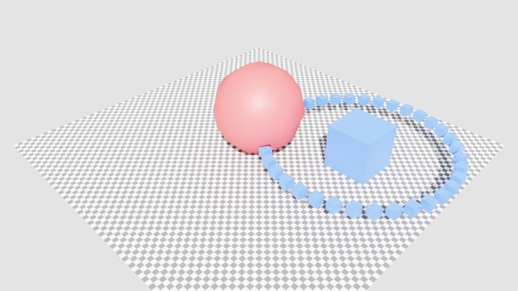

# ovrtx Examples

This directory contains example projects demonstrating various features of ovrtx.

## C Examples

<table>
  <tr>
    <td align="center" width="50%">
      
       
      <b>Minimal</b>
       
      Basic renderer initialization, rendering a single frame from an RGB camera and writing the result to disk as a PNG.
    </td>
    <td align="center" width="50%">
      
       
      <b>Vulkan Interop</b>
       
      Demonstrates ovrtx-Vulkan interoperability, rendering USD scenes and displaying them in a Vulkan window with interactive orbit camera control.
    </td>
  </tr>
</table>

## Python Examples

<table>
  <tr>
    <td align="center" width="50%">
      
       
      <b>Minimal</b>
       
      Basic workflow: create a Renderer, load a USD layer, step the renderer, and map/display the rendered output.
    </td>
    <td align="center" width="50%">
      
       
      <b>Planet System</b>
       
      Animated planetary system using Warp kernels for GPU-accelerated animation, demonstrating dynamic scene modification and zero-copy transform updates.
    </td>
  </tr>
</table>
